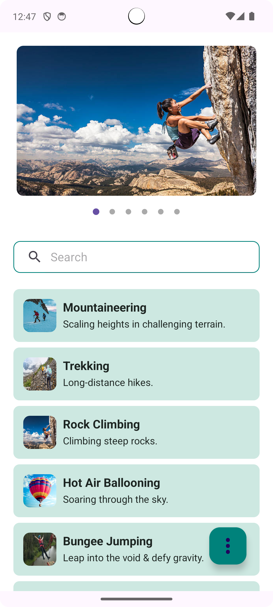
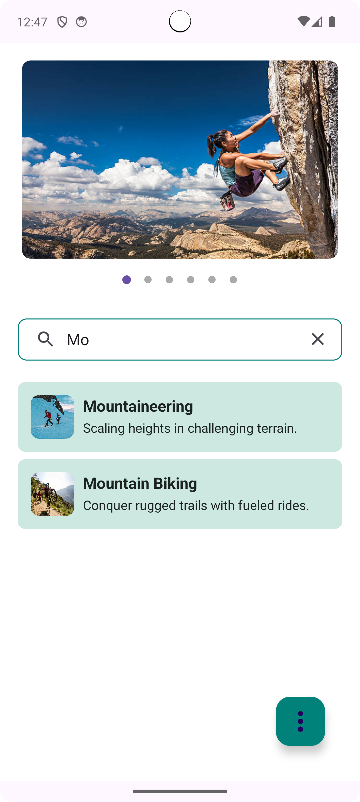
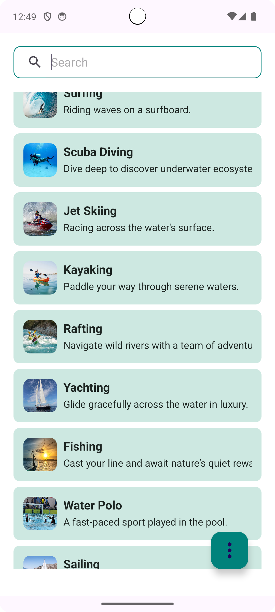
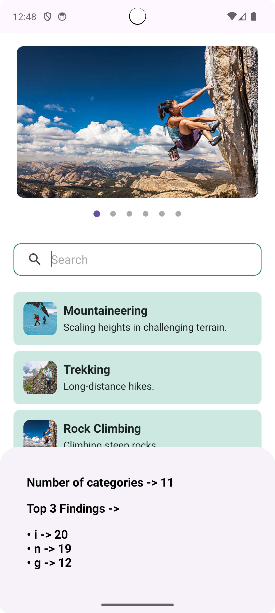
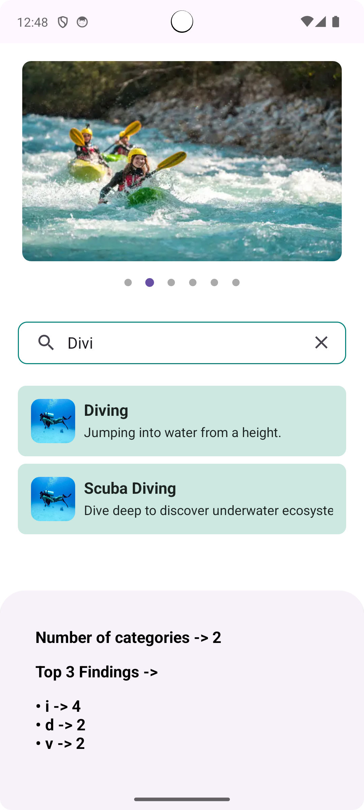

# Sports Catalog App

This Android app is built using **Multimodule Architecture**, **MVVM**, **Clean Architecture**, **Hilt**, and **Jetpack Compose** (with XML for UI). The app displays sports categories in a **ViewPager**, allows filtering with a **Search Bar**, and updates a **RecyclerView** below. Users can see **statistics** in a **bottom sheet** showing the top 3 most frequent characters in the list.

## Features

- **ViewPager**: Displays sports categories.
- **Search Bar**: Filters items in the RecyclerView based on the query.
- **RecyclerView**: Shows types of sports in the selected category.
- **Pinned Search Bar**: The search bar becomes pinned when scrolled above.
- **FAB**: Opens a bottom sheet displaying top 3 frequent characters in the list.

## Architecture

The app follows **Clean Architecture**:

- **Presentation Layer**: Activities/Fragments and ViewModels.
- **Domain Layer**: Use cases for business logic (e.g., fetching sports categories).
- **Data Layer**: Repositories to retrieve data from local sources.

## Libraries Used

- **Hilt** for Dependency Injection.
- **Jetpack ViewModel/StateFlow** for managing UI data.
- **RecyclerView** and **ViewPager** for displaying lists.
- **Coroutines** for background tasks.

## Screenshots

